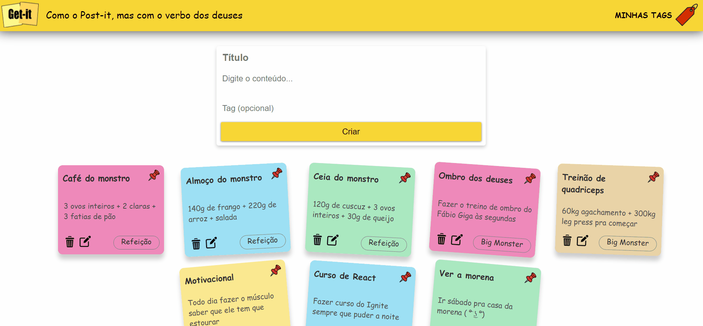

# Getit - Como o Post-it, mas com outro verbo

## Projeto 1B - Tecnologias Web



O projeto consiste na criação de uma aplicação web de um sistema de anotações (ou postits), utilizando [Django](https://www.djangoproject.com/) como framework para o desenvolvimento da aplicação. Além disso, foi utilizado o [PostgreSQL](https://www.postgresql.org/) como banco de dados. O deploy da aplicação foi trabalhado em cima do [Heroku](https://www.heroku.com/).

Antes de instalar as dependências necessárias, recomenda-se a criação de um [ambiente virtual](https://docs.python.org/pt-br/3/tutorial/venv.html).

As dependências estão no arquivo [requirements.txt](requirements.txt). Para instalar, execute:

```python
pip install requirements.txt
```

Se quiser executar localmente, você deve criar um [Docker](https://docs.docker.com/) container para carregar a imagem do Postgres. Para saber mais, veja [aqui](https://hackernoon.com/dont-install-postgres-docker-pull-postgres-bee20e200198).